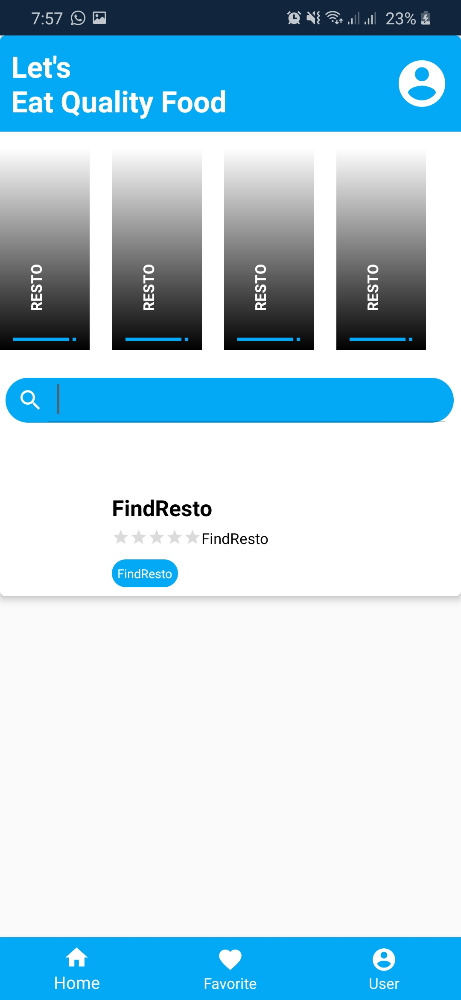

# 11 - FindResto

## Pembuatan Dalam Kuis

1. Data Binding
2. View Model
3. Navigation
4. Fragment

## Hasil Praktikum

# Navigation

# Menu

# LoginFragment

# LoginViewModel

# ModelUser

# FragmentLoginXml

# GenerateFragmentDataBinding

# Hasil Run APP

