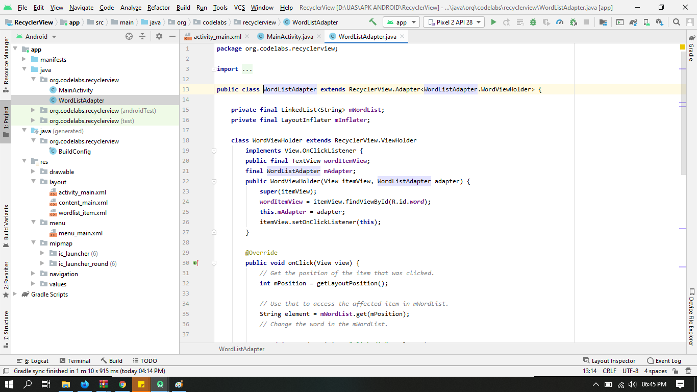
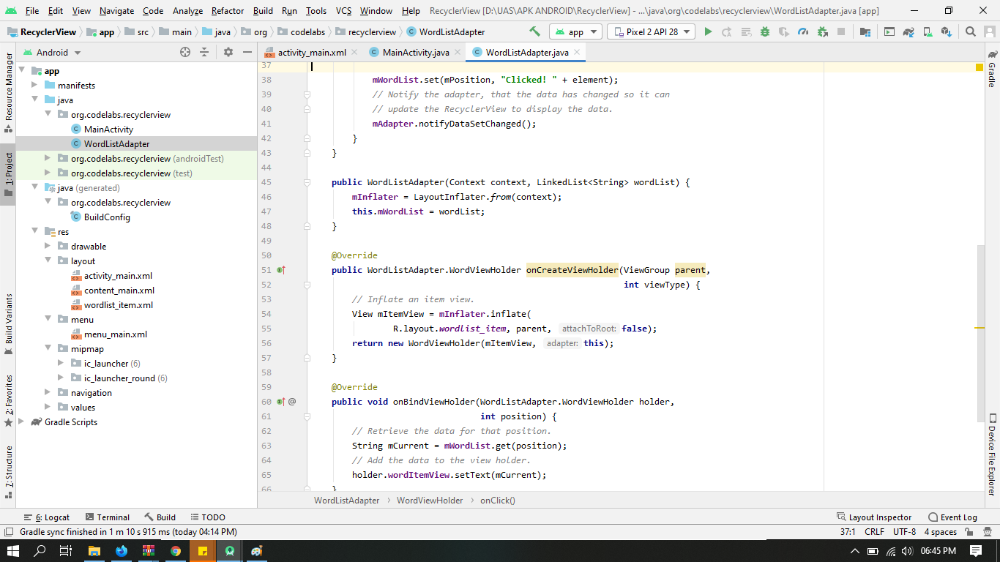
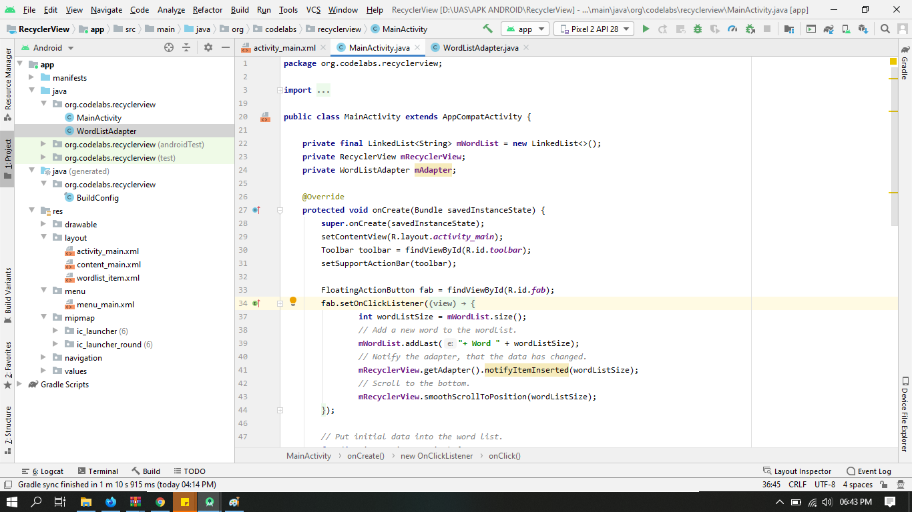
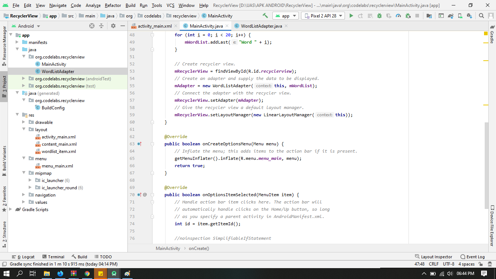
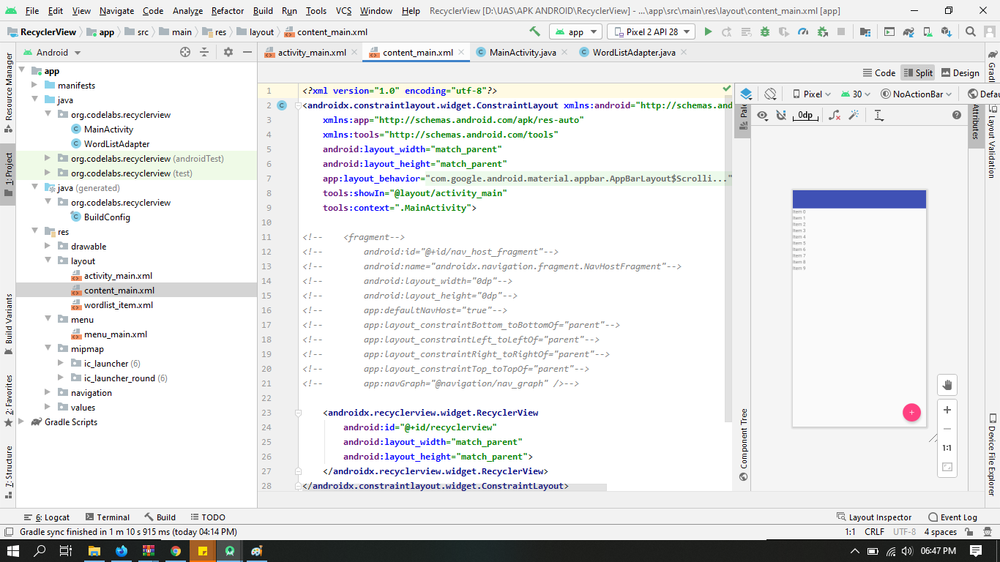
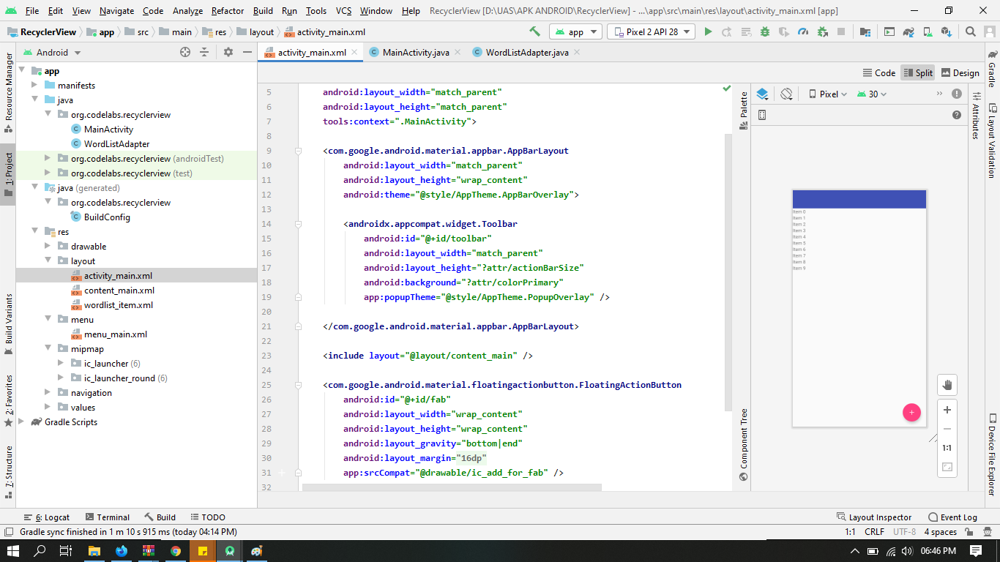
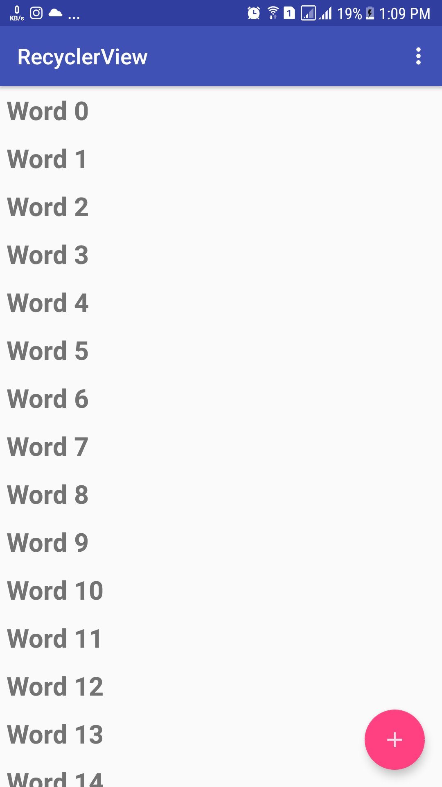
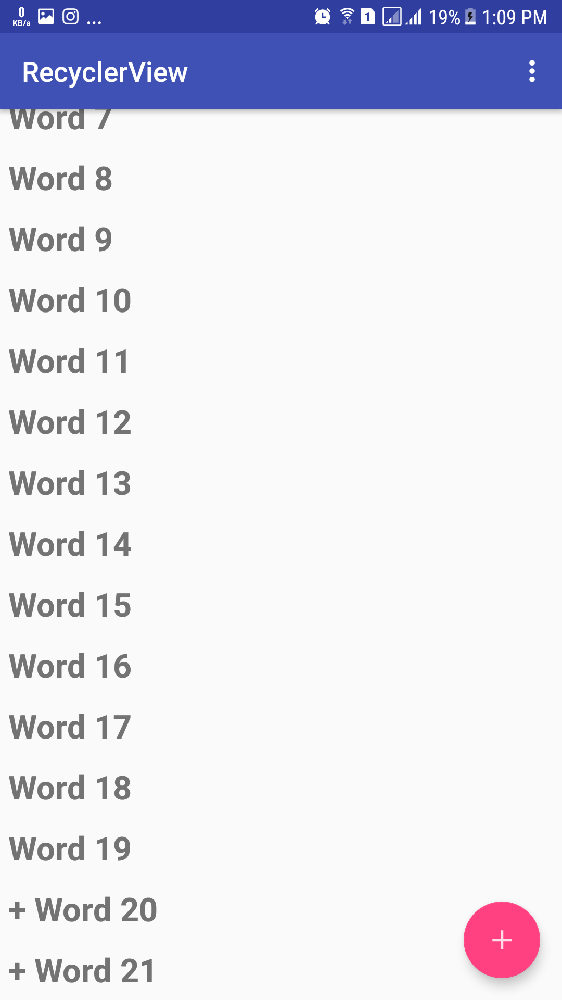

# 13 - Recycler View

## Tujuan Pembelajaran

1. How to use the RecyclerView class to display items in a scrollable list.
2. How to dynamically add items to the RecyclerView as they become visible through scrolling.
3. How to perform an action when the user taps a specific item.
4. How to show a FAB and perform an action when the user taps it.

# Hasil Praktikum

## WorldListAdapter

## MainActivity

## ContentMain

## ActivityMain

## Hasil Run APP

