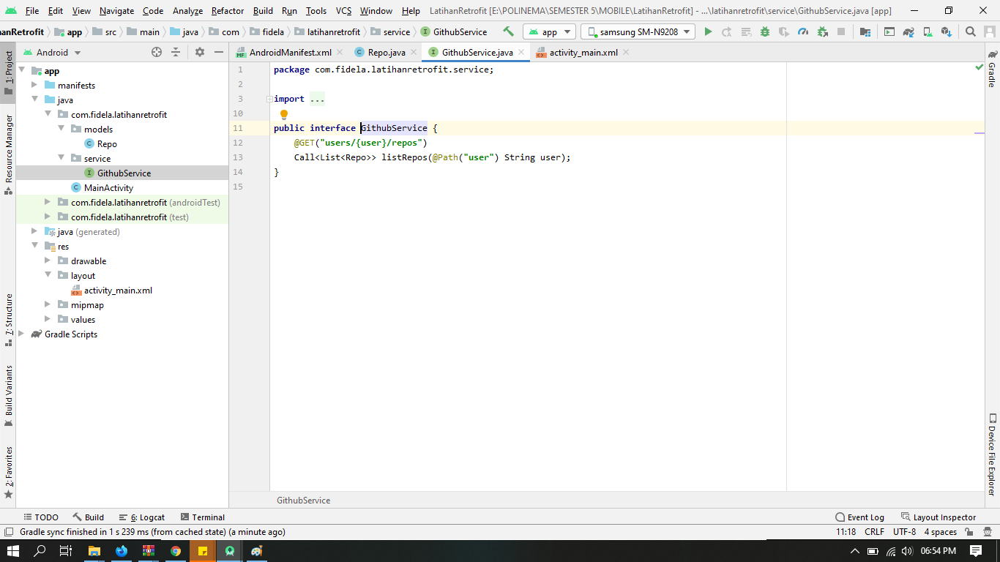
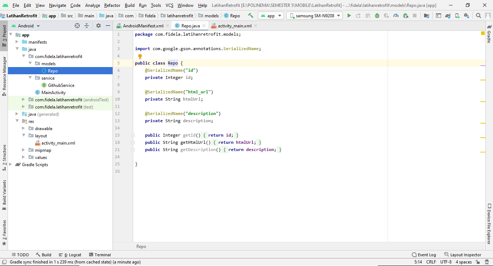
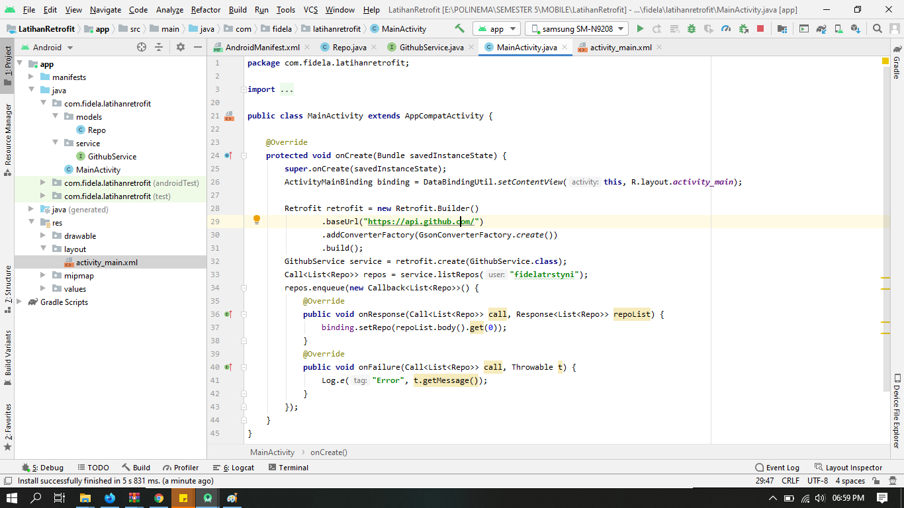
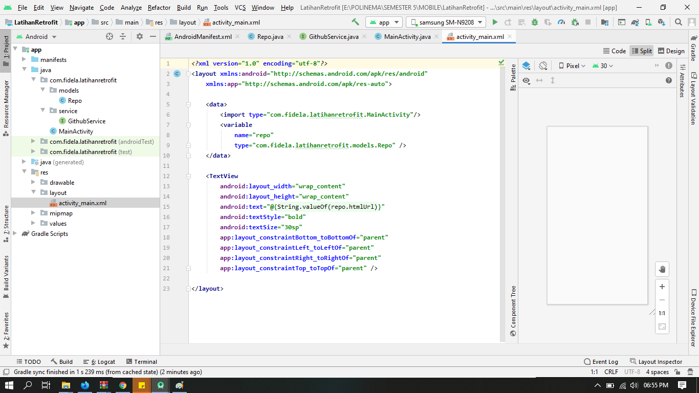
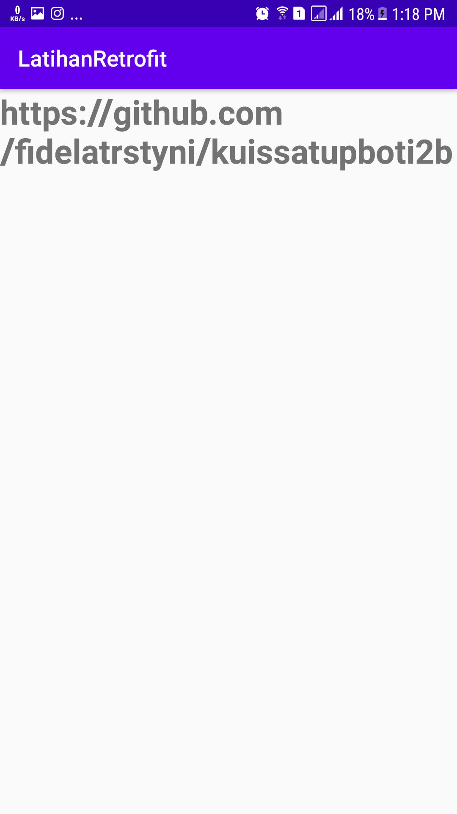

# 14 - Retrofit API

## Tujuan Pembelajaran

1. Mahasiswa mampu mengonfigurasi Retrofit padaandroid
2. Mahasiswa mampu membuat request ke RESTful API menggunakan Retrofit

# Hasil Praktikum

## GithubService

## Repo

## MainActivity

## ActivityMain

## Hasil Run APP

