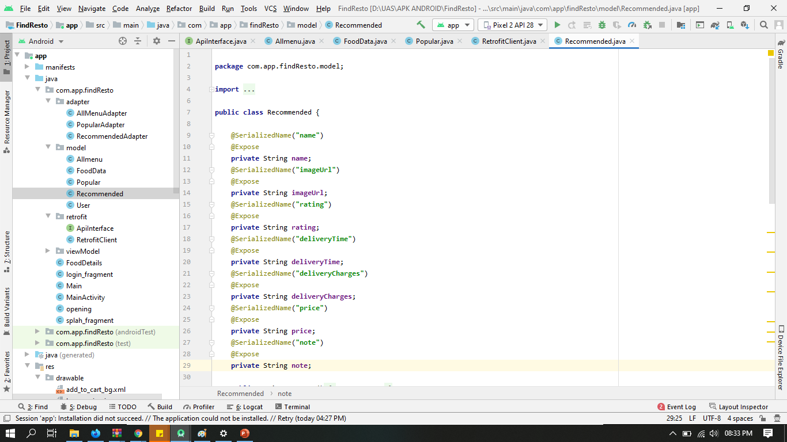
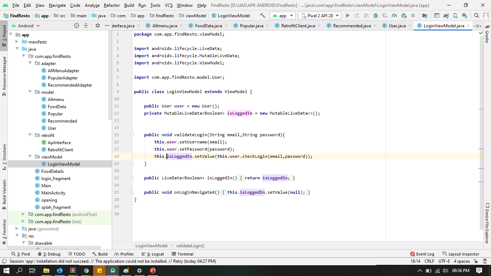
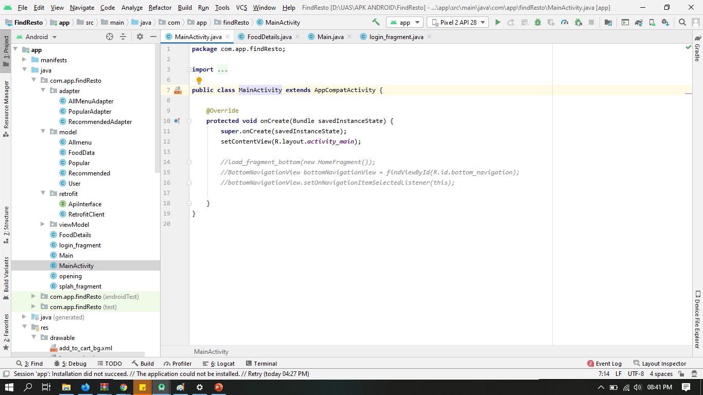
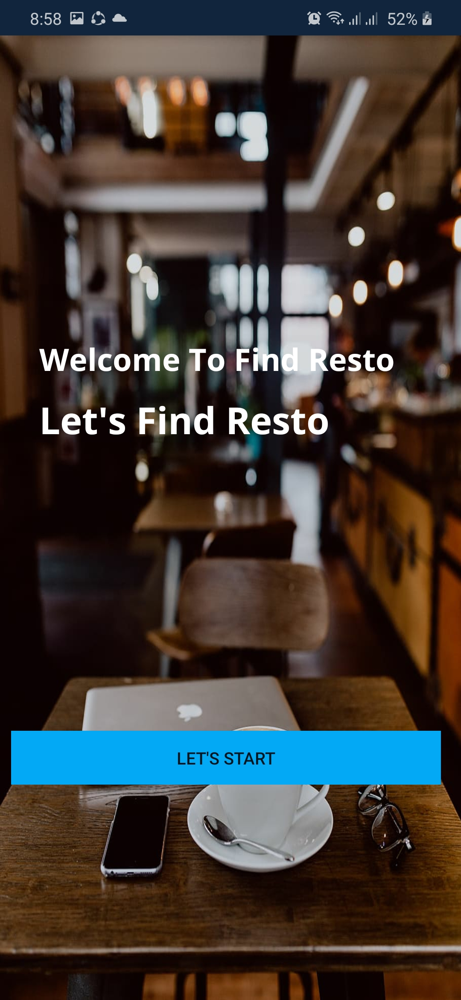

# APLIKASI FIND RESTO

Aplikasi ini saya berikan nama Find Resto. Silahkan klik disini https://github.com/fidelatrstyni/mobile-3e-12/tree/master/SRC/15_find_resto_uas/FindResto . Aplikasi ini menggunakan bahasa pemrograman Java

# Deskripsi Aplikasi

## Fungsi

Fungsi Aplikasi ini untuk mencari restoran terdekat dan melihat restoran yang recommended dan popular. 

## Tujuan

Tujuan nya yaitu membatu user untuk menemukan restoran yang ingin dicari dan makanan apa yang paling rekomendasi dan popular.

# Identitas Pengembang

## NIM : 1841720211

## Nama : Fidela Trisaktiyani

## Kelas : TI 3-E

# Fitur-fitur Aplikasi

1. Restoran Recommended
2. Search
3. Rating
4. Restoran terdekat
5. Restoran Popular

# Rincian Aplikasi

1. Aplikasi ini terdapat Recycler View
2. Aplikasi ini terdapat Retrofit API
3. Aplikasi ini terdapat Data Binding
4. Aplikasi ini terdapat Fragment
5. Aplikasi ini terdapat View Model dan terdapat Nav-Graph

# Rincian Detail Coding

# Nav-Graph

## Nav Graph

# Fragment

## Fragment Splash

## Fragment Login

## Fragment Opening

# Menu Model

## All-menu

## Food Data

## Popular

## Popular

## User

# Retrofit

## API Interface

## Retrofit Client

## JSON File

# View Model

## View Model

# Adapter

## All-menu

## Popular

## Recommended

# Food-Detail

## Food-Detail

# Main-Activity

## Main-Activity

# Layout

## Activity-Food-Detail

## Activity-Main

## All-memu-recycle-item

## Main-Xml

## Popular-Recycler-Item

## Recommended-Recycler-Item

# Program

## Splash

## Login

## Opening

## Beranda Aplikasi

## Food Detail

# Saran

Aplikasi ini masih belom berjalan dengan baik

1. Search belom berfungsi
2. GPS Belom berfungsi
3. Detail Makanan masih belom lengkap dan dimasukkan ke dalam json secara detail

# Kesimpulan 

Saya dapat mengetahui hal baru yaitu membuat aplikasi yang menggunakan retrofit json, recycle view, data binding, view model, fragment, navigation. Dan bagian yang bermanfaat yaitu saya mengetahui dan bisa cara mengconvert dari json menjadi model menggunakan jsonschemapojo

# Sumber Data/ Referensi

Saya belajar aplikasi dengan 
1. https://youtu.be/Vy2vvnDqofs (Retrofit)
2. Codelabs
3. Materi Pembelajaran yang diberikan oleh Dosen
4. https://www.youtube.com/channel/UC5c97OEjuxs1q00dRfCc9zw/videos