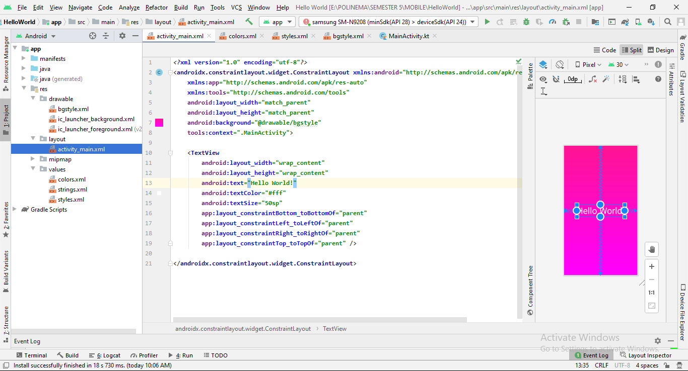
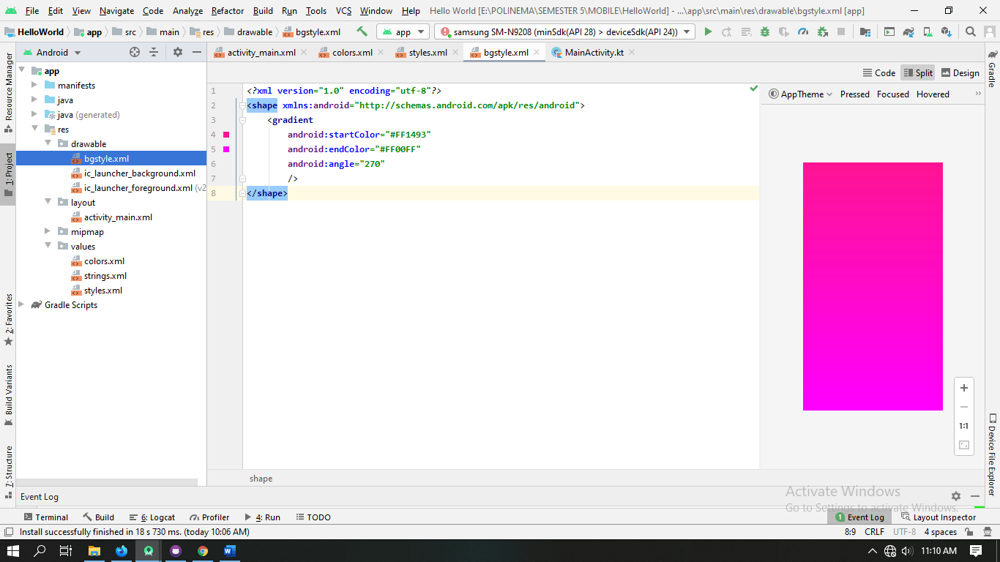
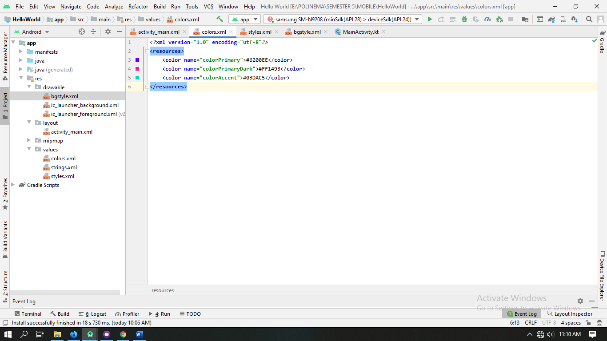
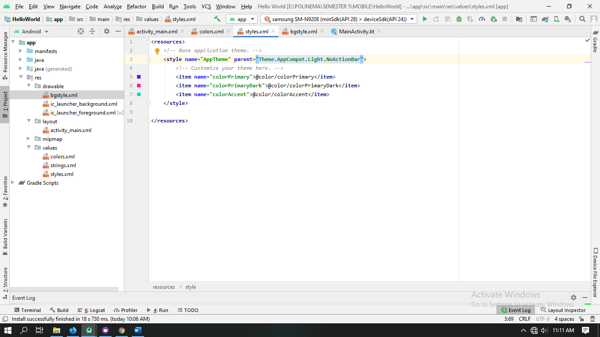

# mobile-3e-12

# PEMROGRAMAN MOBILE

 
# ANDROID STUDIO
# HELLO WORLD PROGRAM

1.	Activity_main.xml

Mengubah tampilan teks dan menghubungkan bgstyle agar dapat tampil ke dalam layer utama

2.	Bgstyle.xml

Memberikan warna pada background

3.	Colors.xml

Mengubah warna-warna pada tampilan. Disini saya mengubah pada action bar menjadi sama dengan background

 

4.	Styles.xml

Disini saya mengubah dengan menghilangkan action bar, dengan mengubah seperti kodingan dibawah ini

 
 
5.	Hasil dari codingan diatas

1.	Menggunakan action bar

 
2.	Tidak menggunakan action bar

 

