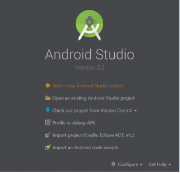

# 02 - Layout

## Tujuan Pembelajaran

1. How to start an Android Studio Project with blank layout

## Hasil Praktikum
1. Start a new Android Studio Project.

2. Continue to set up your project refer with this specification.

“Choose Your Project” dialog

a) Select “Empty Activity”

“Configure Your Project” dialog

b) Name: BasicAppX

c) Package name: org.aplas.basicappx

d) Save Location: any

e) Language: Java

f) Minimum API Level: API 21/Android 5.0 Lollipop

g) This project will support instant apps: Uncheck

h) Use android.* artifacts: Check

“Finish”

“Waiting for synchronizing”

3. Change the content of “build.graddle (Module: app)” file like below, then Sync
it.Continue to set up your project refer with this specification.

| apply plugin: 'com.android.application'
android {
    compileSdkVersion 28
    testOptions.unitTests.includeAndroidResources = true
    defaultConfig {
        applicationId "org.aplas.basicappx"
        minSdkVersion 21
        targetSdkVersion 28
        versionCode 1
        versionName "1.0"
        buildConfigField "int", "MIN_SDK_VERSION", "$minSdkVersion.apiLevel"
        buildConfigField "int", "TARGET_SDK_VERSION", "$targetSdkVersion.apiLevel"
        testInstrumentationRunner "androidx.test.runner.AndroidJUnitRunner"
    }
    buildTypes {
        release {
            minifyEnabled false
            proguardFiles getDefaultProguardFile('proguard-android-optimize.txt'),
                    'proguard-rules.pro'
        }
    }
}
dependencies {
    implementation fileTree(dir: 'libs', include: ['*.jar'])
    implementation 'androidx.appcompat:appcompat:1.1.0'
    implementation 'androidx.constraintlayout:constraintlayout:1.1.3'
    testImplementation 'junit:junit:4.12'
    testImplementation "org.robolectric:robolectric:4.2.1"
    androidTestImplementation 'androidx.test:runner:1.2.0'
} |
