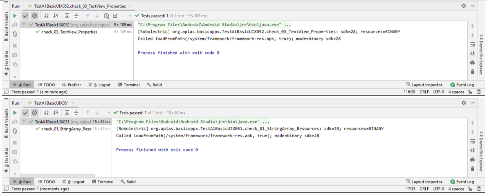
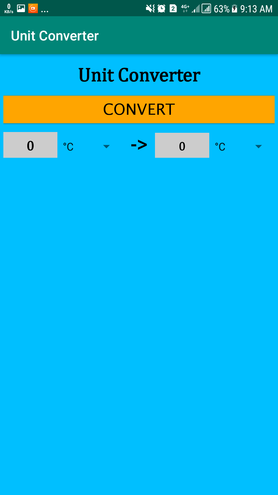
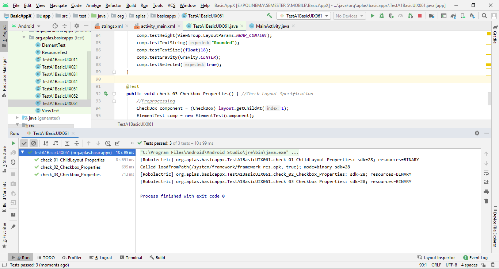
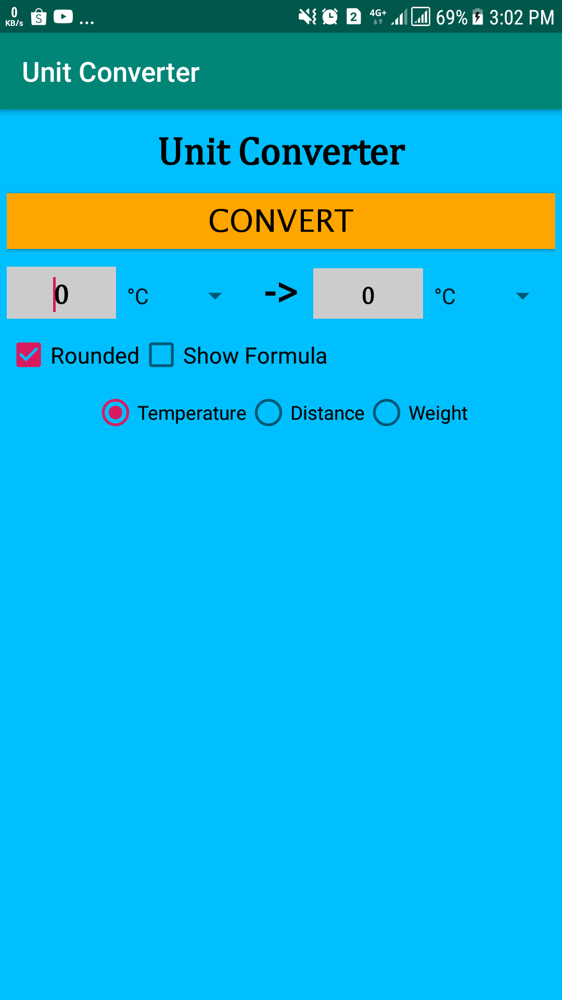
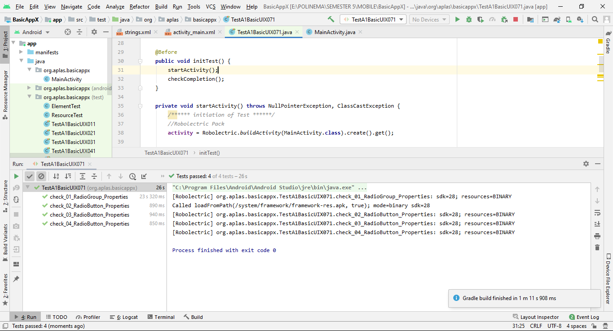
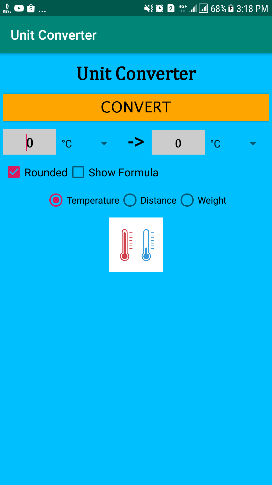
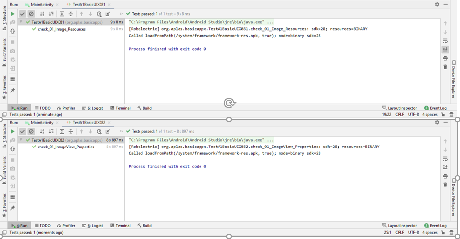
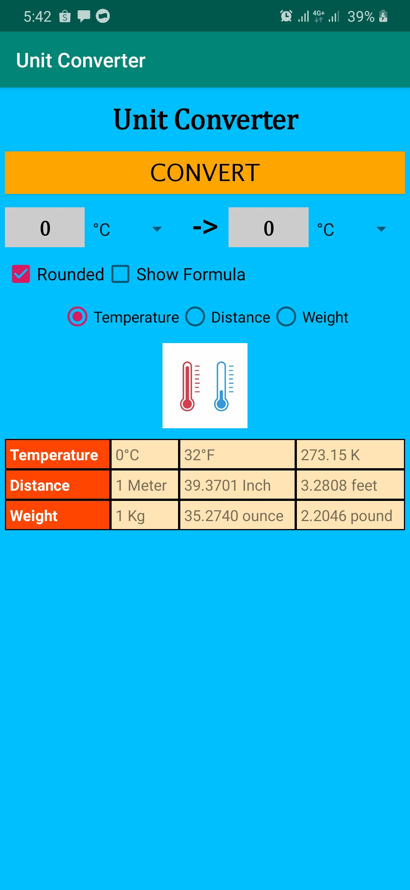
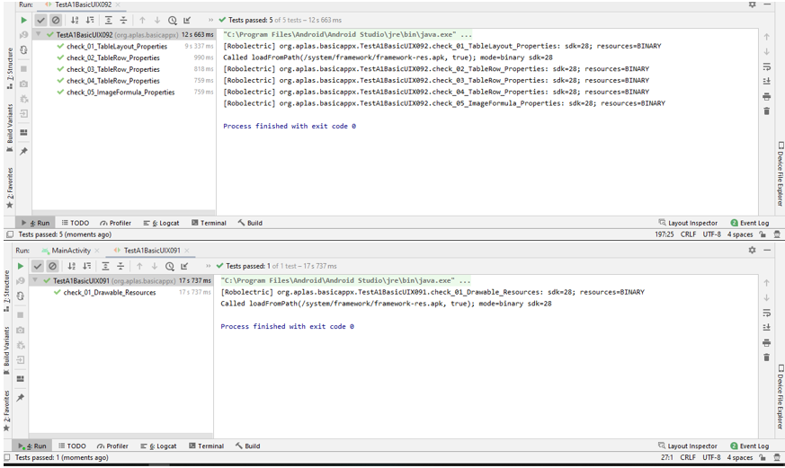

# 02 - Layout

## Tujuan Pembelajaran

1. How to start an Android Studio Project with blank layout
2. How to configure Android Studio project resources, like string and font
3. How to design basic layout, add TextView, and add a Button.

## Hasil Praktikum

# TASK GUIDE (A1X.01)

A. Objectives.Students know how to start an Android Studio Project with blank layout.

B. Result

# TASK GUIDE (A1X.02)

A. Objectives.Students know how to configure Android Studio project resources, like string and font

B. Result

# TASK GUIDE (A1X.03)

A. Objectives. Students know how to design basic layout, add TextView, and add a Button.

B. Result

# TASK GUIDE (A1X.04)

A. Students know how to make Space andadd Child Layout.

B. Result

# TASK GUIDE (A1X.05)

A. Students know how to configure color resources, make EditText, and Spinner.

B. Result

# TASK GUIDE (A1X.06)

A. Students know how to make CheckBox.

B. Result

# TASK GUIDE (A1X.07)

A. Students know how to make RadioGroup and RadioButton.

B. Result

# TASK GUIDE (A1X.08)

A. Students know how to add image resource and make an ImageView.

B. Result

# TASK GUIDE (A1X.09)

A. Students know how to add drawable resource and make a Table.

B. Result

