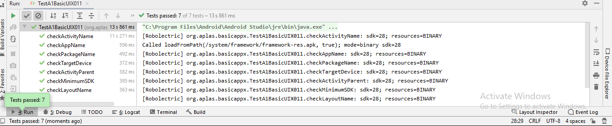
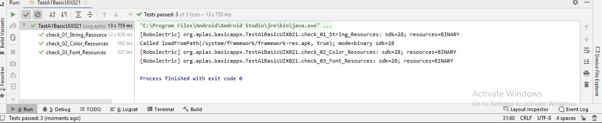
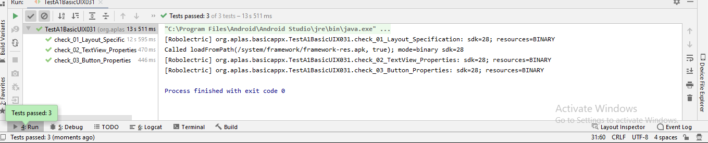
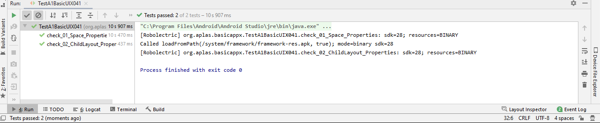
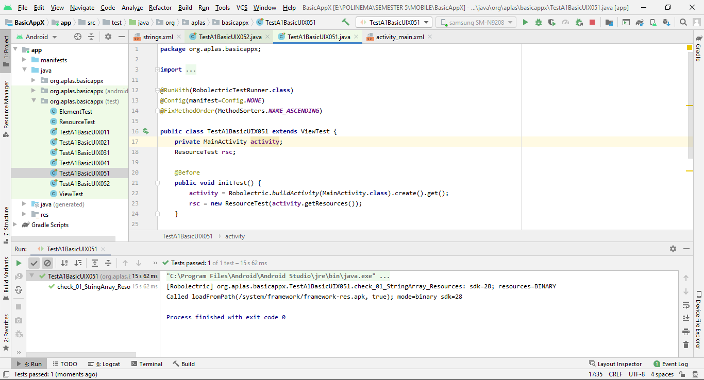
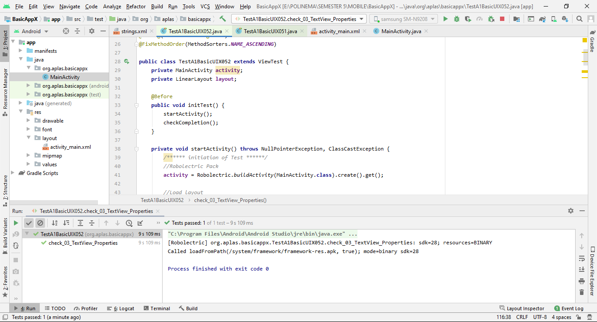

# mobile-3e-12

# PEMROGRAMAN MOBILE

 
# ANDROID STUDIO
# Layout

TASK GUIDE (A1X.01)
A. Objectives.Students know how to start an Android Studio Project with blank layout.
B. Result

TASK GUIDE (A1X.02)
A. Objectives.Students know how to configure Android Studio project resources, like string and font
B. Result

TASK GUIDE (A1X.03)
A. Objectives. Students know how to design basic layout, add TextView, and add a Button.
B. Result

TASK GUIDE (A1X.04)
A. Objectives. Students know how to design basic layout, add TextView, and add a Button.
B. Result

TASK GUIDE (A1X.05)
A. Objectives. Students know how to design basic layout, add TextView, and add a Button.
B. Result

