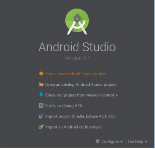
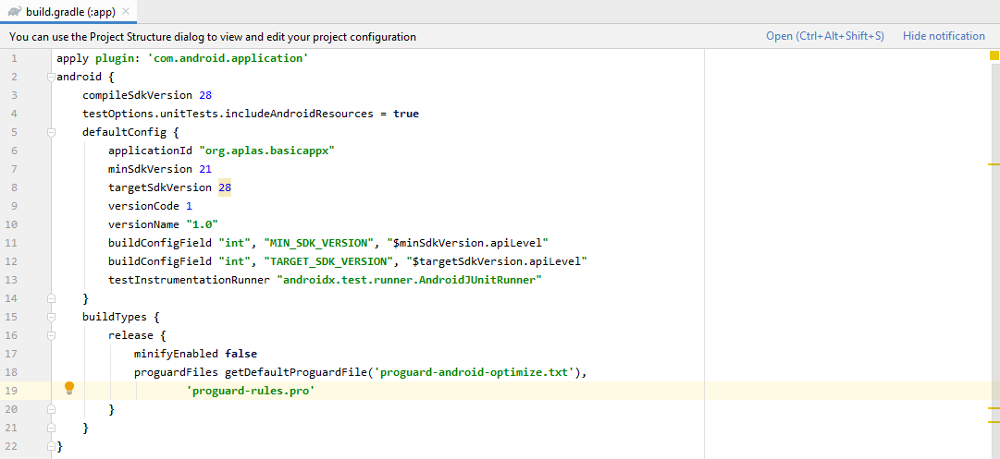
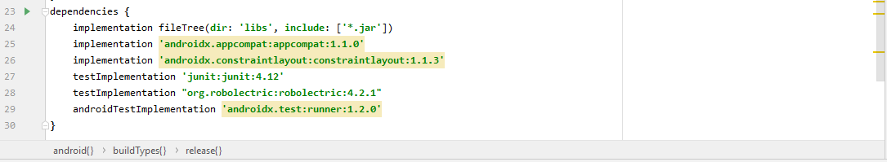
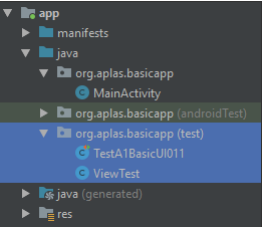
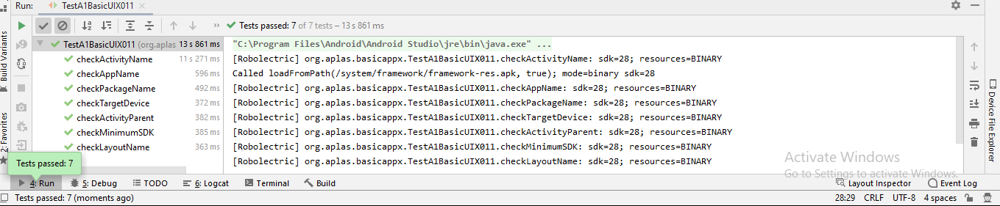

# 02 - Layout

## Tujuan Pembelajaran

1. How to start an Android Studio Project with blank layout

## Hasil Praktikum
## 1. Start a new Android Studio Project.

## 2. Continue to set up your project refer with this specification.

“Choose Your Project” dialog

a) Select “Empty Activity”

“Configure Your Project” dialog

b) Name: BasicAppX

c) Package name: org.aplas.basicappx

d) Save Location: any

e) Language: Java

f) Minimum API Level: API 21/Android 5.0 Lollipop

g) This project will support instant apps: Uncheck

h) Use android.* artifacts: Check

“Finish”

“Waiting for synchronizing”

## 3. Change the content of “build.graddle (Module: app)” file like below, then Sync it.Continue to set up your project refer with this specification.

## 4. Delete “ExampleUnitTest” in “org.aplas.basicapp (test)” folder.

## 5. Copy “TestA1BasicUI011X.java” and “ViewTest.java” file to “org.aplas.basicappx (test)” folder

## 6. Right click on the “TestA1BasicUIX011.java” file then choose Run ‘TestA1BasicUIX011’ and click it. It may take long time to execute.

## 7. Get the result of your task. If passed you will get green check. If the test failed, you would get orange check get the messages and you must start your project again.

