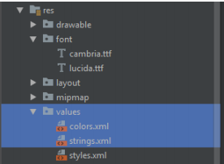

# 02 - Layout

## Tujuan Pembelajaran

1. How to configure Android Studio project resources, like
string and font.

## Hasil Praktikum
## 1. Open BasicAppX project that already test passed.

## 2. Create “font” folder under “res” folder. Right click on the “res” folder and choose “New –Adroid Resource Directory”.

Then show “New Resource Directory”, and select Resource type: “font”, then Click “OK”.

## 3. Copy file “cambria.ttf” and “lucida.ttf” in Supplement folder to “font” folder that already created.

## 4. Open “strings.xml” file under “res/values” folder

## 5. Edit the value of all “string” name as described below. Template: <string name=”string-name”>string-value</string>

## 6. Open “colors.xml” file under “res/values” folder and edit the value of all “color” name as described below. Template: <color name=”color-name”>color-value</string>

## 7. Copy “TestA1BasicUIX021.java” and “ResourceTest.java” file to “org.aplas.basicappx (test)” folder

## 8. Right click on the “TestA1BasicUIX021.java” file then choose Run ‘TestA1BasicUIX021’ and click it. It may take long time to execute.

## 9. Get the result of your task. If passed you will get green check like picture below. If the test failed, you will get orange check get the messages and you must start your project again.

