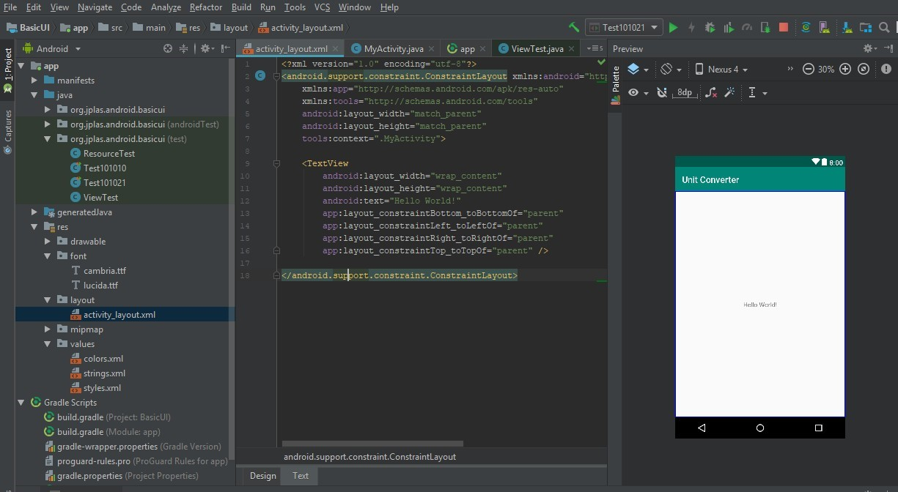
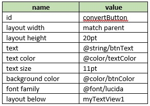

# 02 - Layout

## Tujuan Pembelajaran

1. How to design basic layout, add TextView, and add a Button.

## Hasil Praktikum
## 1. Open BasicAppX project that already test passed.

## 2. Open “activity_main.xml” file in layout resource, to start UI design..

Then show “New Resource Directory”, and select Resource type: “font”, then Click “OK”.

## 3. On the layout xml editor, delete default “ConstraintLayout” with all its tag and create an “RelativeLayout” with id “mainLayout” as a main layout refer on the specification below.

## 4. In the RelativeLayout tag, add a TextView with id “myTextView1” refer in
specification below.

## 5. Under TextView, add a Button with id “convertButton” refer in specification below.

## 6. The UI become like below.

## 7. Copy “TestA1BasicUIX021.java” and “ResourceTest.java” file to “org.aplas.basicappx (test)” folder

## 8. Right click on the “TestA1BasicUIX031.java” file then choose Run ‘TestA1BasicUIX031’ and click it. It may take long time to execute.

## 9. Get the result of your task. If passed you will get green check like picture below. If the test failed, you will get orange check get the messages and you must start your project again.

