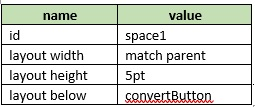
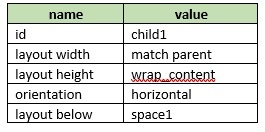
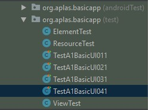
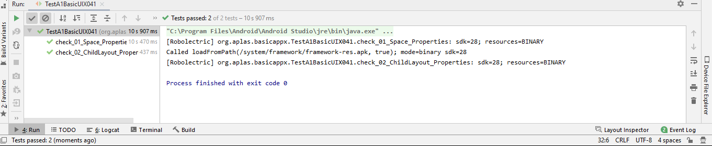

# 02 - Layout

## Tujuan Pembelajaran

1. How to make Space and add Child Layout.

## Hasil Praktikum
## 1. Open BasicAppX project that already test passed.

## 2. Open activity_main.xml file, to start UI design.

## 3. On the layout xml editor, create an “Space” with id “space” refer on the
specification below.

## 4. Under the Space, add a LinearLayout as Child Layout with id “child1” refer on specification below.

## 5. The UI become like below

## 6. Copy “TestA1BasicUIX041.java” file to “org.aplas.basicapp (test)” folder

## 7. Right click on the “TestA1BasicUIX041.java” file then choose Run ‘TestA1BasicUIX041’ and click it. It may take long time to execute.

## 8. Get the result of your task. If passed you will get green check. If the test failed, you will get orange check get the messages and you must start your project again.

