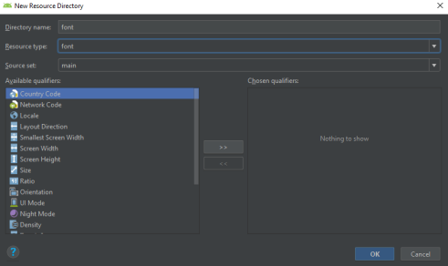

# 02 - Layout

## Tujuan Pembelajaran

1. How to configure color resources, make EditText, and Spinner.

## Hasil Praktikum
## 1. Open BasicAppX project that already test passed.

## 2. Open “strings.xml” file under “res/values” folder

## 3. Add the value of all “string-array” name as described in specification below. Template: <string-array name=”string-name”> <item>value1</item> <string-array>

## 4. Open activity_layout.xml file, to start UI design.

## 5. In the LinearLayout “child1” tag, add an EditText with id “inputText” refer on specification below.

## 6. Under EditText, add a Spinner with id “oriList” refer on specification document.

## 7. Under Spinner, add a TextView with id “myTextView2” refer on specification document.

## 8. Under TextView, add a EditText with id “outputText” refer on specification document.

## 9. Under EditText, add a Spinner with id “convList” refer on specification document.

## 10. The result like below.

## 11.	Copy “TestA1BasicUIX051.java” and “TestA1BasicUIX052.java” file to “org.aplas.basicapp (test)” folder.

## 12.	Right click on the “TestA1BasicUIX051.java” file then choose Run ‘TestA1BasicUIX051’ and click it. It may take long time to execute. Do it for “TestA1BasicUIX052.java” file also.

## 13.	Get the result of your task. If passed you will get green check like below. If the test failed, you will get orange check get the messages and you must start your project again.

