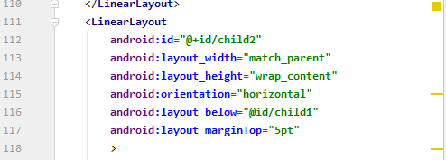
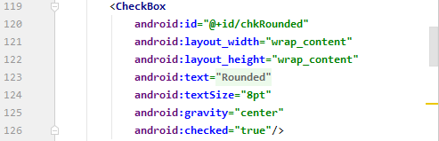
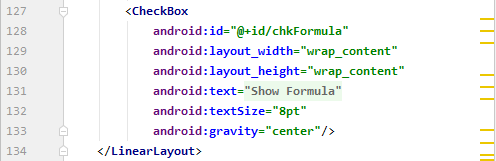
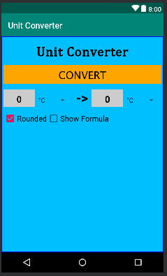
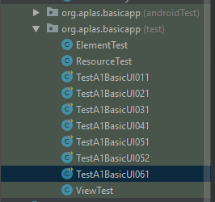
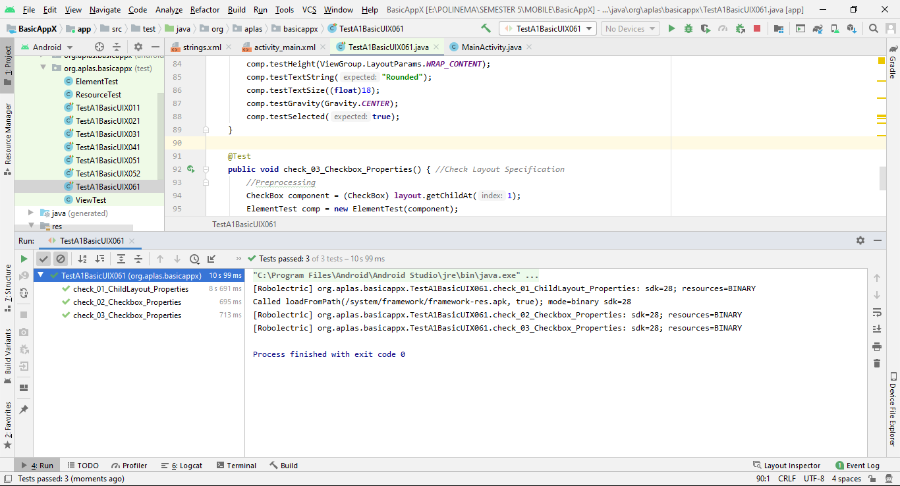
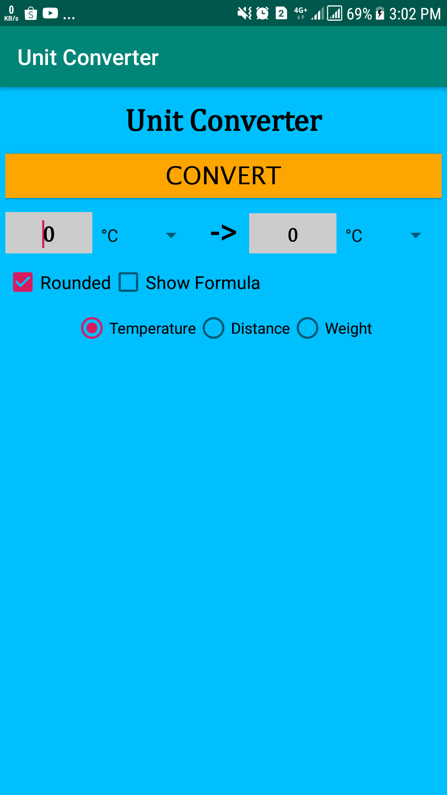

# 02 - Layout

## Tujuan Pembelajaran

1. How to make CheckBox.

## Hasil Praktikum
## 1. Open BasicAppX project that already test passed.

## 2. Open activity_main.xml file, to start UI design.

## 3. Under LinearLayout “child1”, create a LinearLayout with id “child2” refer on the specification below.

## 4. In the “child2” tag, add a CheckBox with id “chkRounded” refer on specification below.

## 5. Under checkbox “chkRounded”, add a CheckBox with id “chkFormula” refer on specification document.

## 6. The result like below.

## 7. Copy “TestA1BasicUIX061.java” file to “org.aplas.basicapp (test)” folder

## 8. Right click on the “TestA1BasicUIX061.java” file then choose Run ‘TestA1BasicUIX061’ and click it. It may take long time to execute.

## 9. Get the result of your task. If passed you will get green check like below. If the test failed, you will get orange check get the messages and you must start your project again.

## 10. The result like below.

