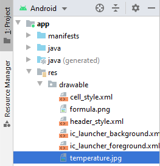
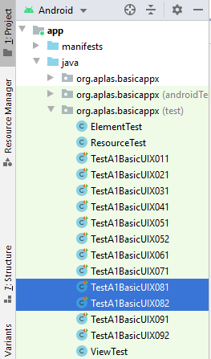

# 02 - Layout

## Tujuan Pembelajaran

1. How to add image resource and make an ImageView.

## Hasil Praktikum
## 1. Open BasicAppX project that already test passed.

## 2. Copy file “temperature.jpg” in Supplement folder to “drawable” folder under “res” folder.

Choose “drawable” the click OK

## 3. Open activity_main.xml file, to start UI design.

## 4. Under RadioGroup “radioGroup”, create an ImageView with id “img” refer on the specification below.

## 5. The result like below.

## 6. Copy “TestA1BasicUIX081.java” and “TestA1BasicUIX081.java” file to “org.aplas.basicappx (test)” folder.

## 7. Right click on each test file(s) then choose Run and click it. It may take long time to execute.

## 8. Under TextView, add a EditText with id “outputText” refer on specification document.

