# 02 - Layout

## Tujuan Pembelajaran

1. How to add drawable resource and make a Table.

## Hasil Praktikum
## 1. Open BasicAppX project that already test passed.

## 2. Copy file “cell_style.xml” and “header_style.xml” in Supplement folder to “drawable” folder under “res” folder.

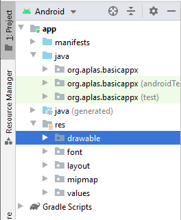

Choose “drawable” and clink OK.

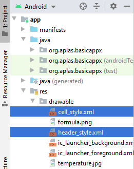

## 3. Open activity_main.xml file, to start UI design.

## 4. Under ImageView “img”, create a TableLayout with id “table” refer on the specification in specification below.

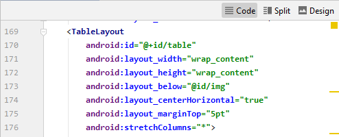

## 5. In the TableLayout tag, add 3 TableRow(s) with no properties.

## 6. In each TableRow(s) tag, add 1 TextView as “header” refer on the specification in specification document.

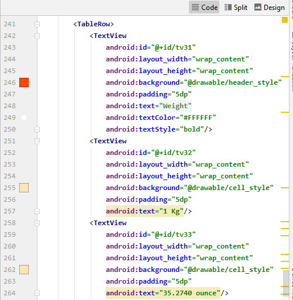
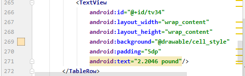

## 7. In each TableRow tag, under header textview, add 3 TextView(s) as “content” refer on the specification in specification document.

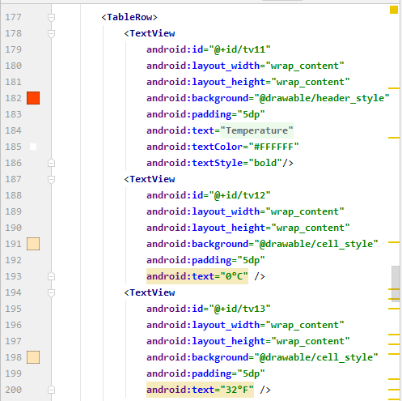
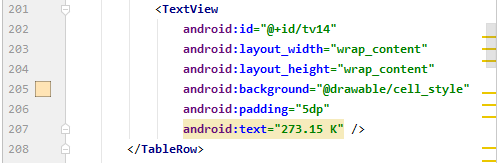
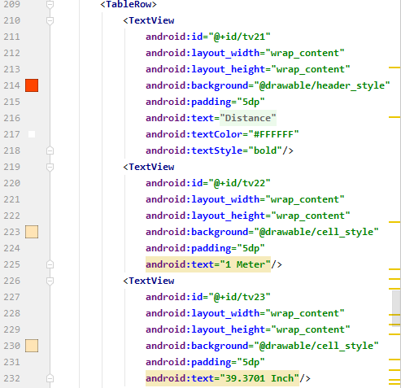
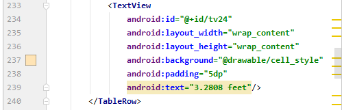

## 8. The result like below.

## 10. Copy “TestA1BasicUIX091.java” and “TestA1BasicUIX092.java” file to “org.aplas.basicappx (test)” folder.

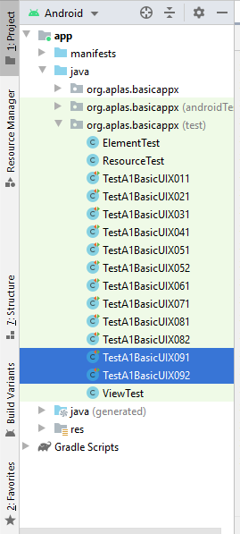

## 11. Right click on each test file(s) then choose Run and click it. It may take long time to execute.

## 12. Get the result of your task. If passed you will get green check like below. If the test failed, you will get orange check get the messages and you must start your project again.

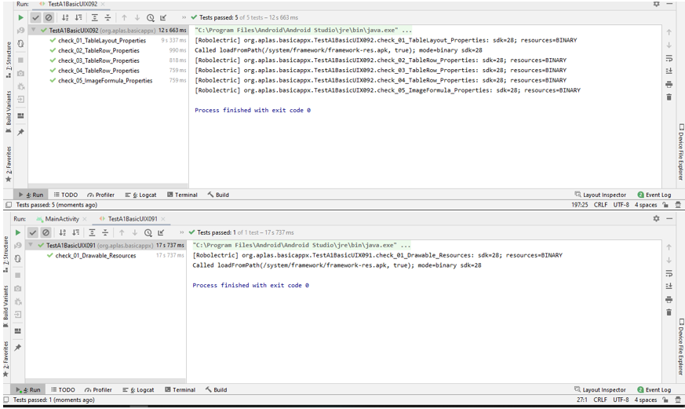

## 13. If all test already passed, you can run MainActivity and will be showed the UI like below.

