# 02 - Layout

## Tujuan Pembelajaran

1. How to create a Temperature class to convert unit.
2. How to create a Distance class to convert unit
3. How to create a Weight class to convert unit.
4. How to make fields and methods in main activity class.
5. How to understand about activity lifecycle when on Create and on Start.
6. How to understand about RadioGroup changed event and how to
change Spinner content.
7. How to create a method to do conversion 
8. How to Make some events action for Button, Spinner, and CheckBox
9. How to  create a new image element and fill it when formula checkbox
checked.

## Hasil Praktikum

# TASK GUIDE (A1X.01)

A. How to create a Temperature class to convert unit.

B. Hasil

# TASK GUIDE (A1X.02)

A. How to create a Distance class to convert unit

B. Hasil
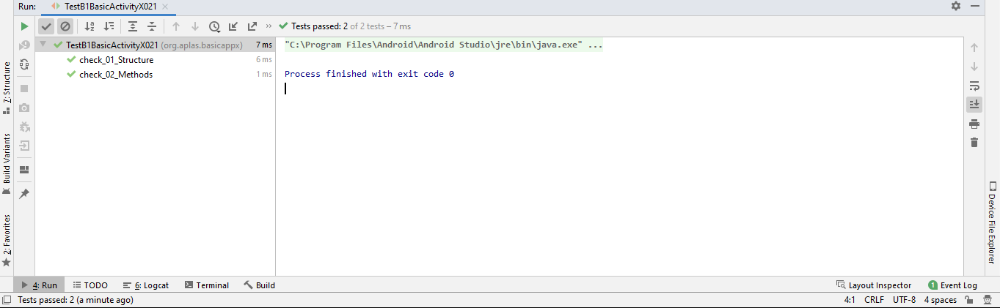

# TASK GUIDE (A1X.03)

A. How to create a Weight class to convert unit.

B. Hasil
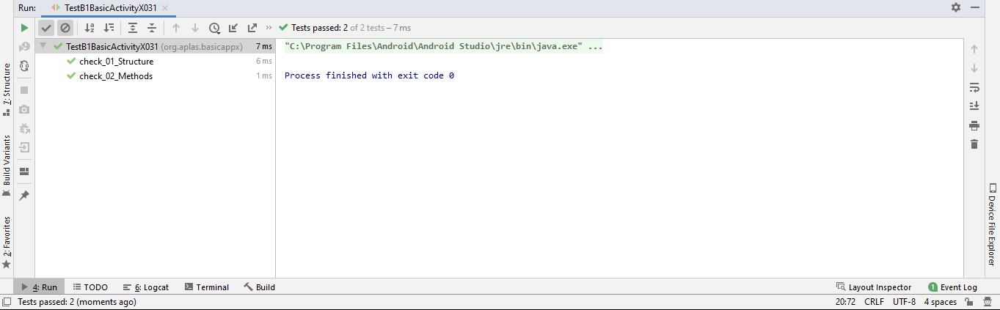

# TASK GUIDE (A1X.04)

A. How to make fields and methods in main activity class.

B. Hasil
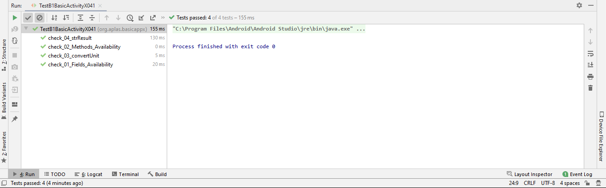

# TASK GUIDE (A1X.05)

A. How to understand about activity lifecycle when on Create and on Start.

B. Hasil
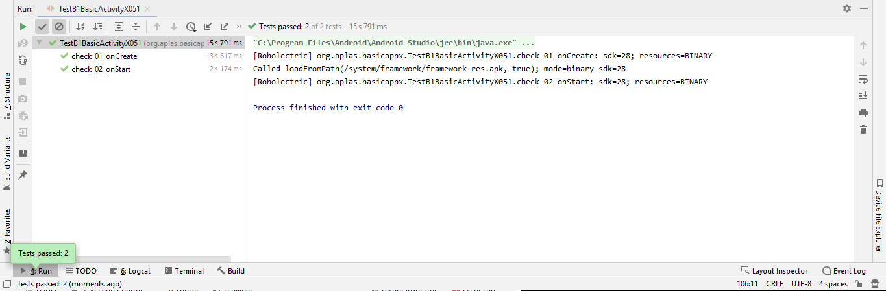

# TASK GUIDE (A1X.06)

A. How to understand about RadioGroup changed event and how to
change Spinner content.

B. Hasil
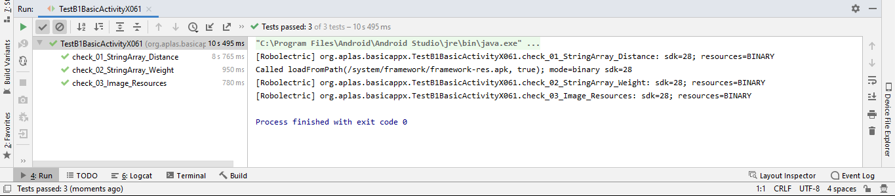

# TASK GUIDE (A1X.07)

A. How to create a method to do conversion 

B. Hasil
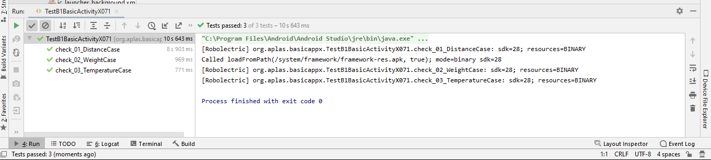

# TASK GUIDE (A1X.08)

A. How to Make some events action for Button, Spinner, and CheckBox

B. Hasil
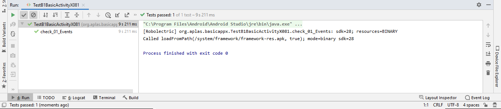

# TASK GUIDE (A1X.09)

A. How to  create a new image element and fill it when formula checkbox
checked.

B. Hasil
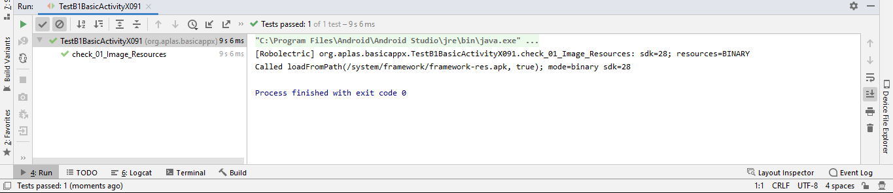
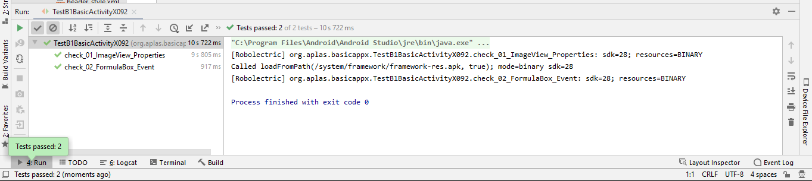

# Output Aplikasi

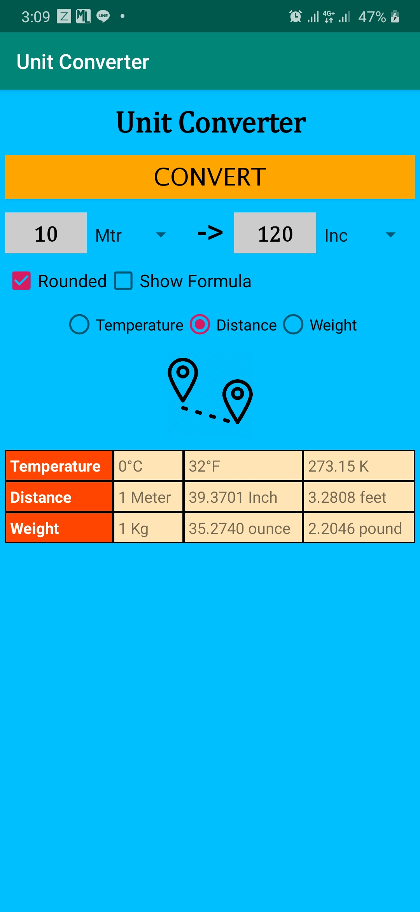
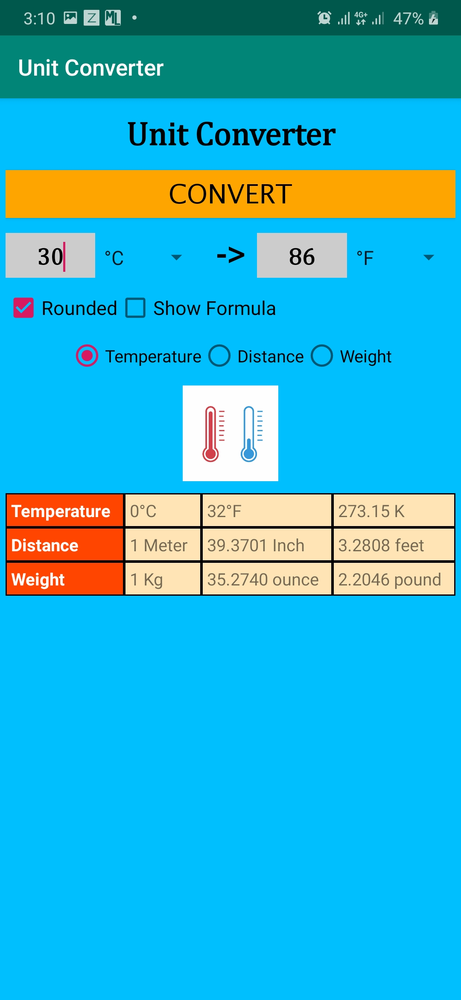
