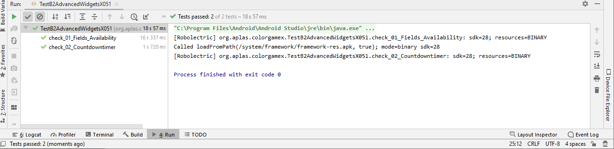

# 03 - Basic Activity

## Tujuan Pembelajaran

1. How to create simple game Android application. First with project configuration and resource configuration.
2. Understand about style, theme,and drawable vector image.
3. How to make the UI for project of Color Gamewith some onClick attribute.
4. How to declare fields needed by application and define method to check validity to enter the game.
5. How to understand how Countdowntimer works.
6. How to access array from resource and put it into List and Hashtable.
7. How to start the timer to start the game.
8. How to handle timer and calculate the score

## Hasil Praktikum

# TASK GUIDE (A1X.01)

A. How to create simple game Android application. First with project configuration and resource configuration.

B. Hasil

# TASK GUIDE (A1X.02)

A. Understand about style, theme,and drawable vector image.

B. Hasil

# TASK GUIDE (A1X.03)

A. How to make the UI for project of Color Gamewith some onClick attribute.

B. Hasil

# TASK GUIDE (A1X.04)

A. How to declare fields needed by application and define method to check validity to enter the game.

B. Hasil

# TASK GUIDE (A1X.05)

A. How to understand how Countdowntimer works.

B. Hasil

# TASK GUIDE (A1X.06)

A. How to access array from resource and put it into List and Hashtable.

B. Hasil

# TASK GUIDE (A1X.07)

A. How to start the timer to start the game.

B. Hasil

# TASK GUIDE (A1X.08)

A. How to handle timer and calculate the score

B. Hasil

# Output Aplikasi

